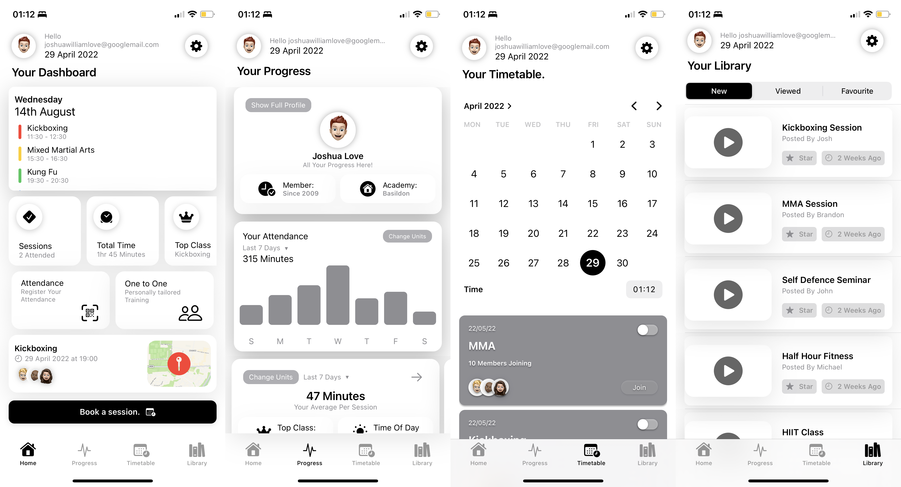

# Swift Fitness Companion

# Mains Views and Navigation

My application contains several views in which the user can navigate between. In this instance I will describe the four main views once the user has gained access to app, and the master view and how navigation is created. 

The four main views that are core to the fundamental objectives of the application, are HomeView, StatsView, TimetableView, and LibraryView. The master view or “main view” is also included but it is invisible to the user. The user has access to these 4 key views once logging into to application. See figure 7 below showing these views. 

To explain the construction of the navigation, Swift UI uses a system in which when you create a view it can be called or used inside of another view. Calling these views will embed this inside of the view you are currently operating in. The four main views exist inside a main view. Each of the views are embedded inside of a tab view, on a main view. This is allows for the main view as to act as a master view and represent each view in reference to their own tab. The user can easily navigate between each view by the use of the tab bar generated in the main view. Below shows each view being called inside of a TabView and each creating their own unique tab item and identifier in which the user interacts with. 

I made a decision fairly early on that the construction the main pages of the application would be built off a block based structure. If views are separate and contained within their own files, calling them and editing them becomes much easier and if they prbecause of my custom views, but this purely a design choice, custom views can appear seaove to be problematic, they can be lifted straight out. My main pages appear segmented because of my custom views, but this purely a design choice, custom views can appear seamles

Each view calls a custom component view I have called header view, this ensures that the all the pages have the same header and access to logging out capabilities. However, there is a custom view called title view that when called, has a parameter that is input to show the differing titles of each view. 

 ## Home View  
 Home view is the first view the user is greeted with when logging into the application. Home view is constructed entirely from other component views I have developed which each serve an individual purpose, that will each be explained in detail.  Swift UI make use of an object called “Stacks”. Stacks are fundamental to layout and organisation within views in Swift UI. 
There are 3 types of stacks in Swift UI which are ZStack, HStack, VStack. The HStack supports horizontal orientation of elements, the ZStack supports vertical and the ZStack supports foreground and background layout orientations. 
For example, storing 3 elements in a HStack, stores the objects from left to right. The first that is declared takes the leftist most position. A VStack works the same way but from top to bottom. 
Almost all views are embedded in a VStack to begin because they must follow the format of top to bottom. 
Home view is calling custom views, in a VStack. It includes my header view, a custom title, and the rest called are all custom sub views. However, home view does make use of a scroll view in which the main card you see at the top of the view can be swiped through to each day of the week. A scroll view essentially makes any contents inside of it scrollable, a common implementation in Swift UI. 
Home view is built to show your upcoming events and give information on demand without further exploration of the application. It holds a booking button that allows you to book a class without traversing through the app. 

## Stats View
Stats View follows the same concept as the other main views, by calling my header view and a title view with a custom parameter in order to set the title of the page. However, unlike home view, the whole of the view is embedded in a scroll view. The scroll view contains each custom view I have created which contain some interactable features, and some horizontal scroll views so you can swipe left of the content, to reveal views that otherwise would not fit on the page. Stats view is built to represent user data based on the model content provided. Graphical representations, and other statistics are held in this view, but the functional code is all held inside the custom views. 

## Timetable View

Timetable view consists of a header view with a title view with a custom parameter to give the title. We make use of the Date Picker object that Apple provides in this view. The Date picker is essentially a calendar that can be used to pick a date value. My choice was to use this date picker object as a calendar so that when you choose a relevant date, all classes or events that are on that day appear underneath in the form of a booking card. The booking cards are views that are based off model data. In theory the user would select a date, and it would present the correct events based on that date. A scroll view is implemented for the booking cards so that they are scrollable and you can see them if they are obscured by the lack of space in the view

## Library View

The same concept is as followed for the header view and title view. The library view offers an object called a segmented picker. This segmented picker shows data based on your choice of the picker. This was created using a switch case statement and an enumeration.  The user picks a panel on the picker object and is presented with an array of videos based on their choice, these arrays are stored in a model. 
Each case in the switch statement builds each view from each array using a ForEach loop and changes the parameters to represent different videos. The video preview view is built to support being called by custom parameters and is adaptable to change. These parameters are defined as “title” , “thumbnail” and “poster.” The view is then called to a ForEach Loop and iterates through each array and it’s values, which are stored a model called videos. Three cases are created because of the three options the picker holds. 
Once the switch case statement was made, the picker essentially loops through the cases provided and presents each array of videos based on it’s selection. The video previews are presented in a list with custom swipe actions to represent certain actions like favouriting or removing a video from a list. 

# Component Views and Uses

## Header View
Header view is the view in which it   is called to the four main pages inside my application. It consists of a state object which references the login and sign up view model, so the view can use the logout function as specified within that view model. The header view uses a date formatter and an initialise method to show the current date within the view. The view makes use of Firebase, which is in relation to the login and signup view model. The user’s email is presented at the top of the page, to show the user who is logged in. The logout function is called from the view model and is used on the right hand side of the view on the settings icon. The view is called with no custom parameters but it is consistently used throughout the main application interface. 

## Title View
Title view is a simple view, a text object is declared at a certain size and alignment within a HStack. The text object is passed a variable labelled title, and when called in other views, a string value of “title” is passed in. Therefore creating unique and formatted names for the main views. 

## Personal View
Personal View represents user data in a card like fashion with a profile picture and name declared within the view. This is called to stats view and heads up a main profile view. The view is simple and can be further connected to the firebase database to show real time login and user data. There is a button that holds the value of “show full profile” and I hope to adapt the button, so it provides further context of explaining that profile shown. It has two tabs each easily customizable to represent any relevant data. 

## Average View and Card Stats View

Average view follows a similar format to personal view and is a direct adaptation of that view. The view shows your average time spent per session over a seven period. This calculation is based on the model data provided, which is represented elsewhere on the same page. A tabular view that again can be used to represent live data easily. 

Card stats view is another adaption of average view just built to represent different data. It shows the hours spent in attendance for the week. It also gives reference to how many sessions attended on a weekly period and how many have been missed. Views that are very easy adapt to live database. The attendance tabs are component views themselves, called individual cards. 

## Individual Card View
As stated above, a view that easily can represent live data when passed in as a variable. The holds a few parameters, such as icon, description, and colour, it can be used and fully customised essentially without being redeclared entirely each time. It is used in other views such as personal and average view. 

 ## Home tabs, and Summary View
These two views are exclusively used on the home page and essentially serve the same purpose apart from having different stylings. They both have the potential to represent model data and can be changed via custom parameters when called for easier customisation. 

## Graph View
Graph view is a bar chart that represents data based on the attendances model. It shows and demonstrates attendance over a seven-day period and each day’s individual value when triggered by a dragging gesture. To achieve this two main functions were built. The get max function returns the max value from the model data to get the height the graph needs to represent data. Once the max height is achieved it can be called inside the card view function. 
Calling this function leads to being able to emulate a max height in the graph and therefore allowing the other bars to be proportional and accurate. The frame is modelled around the max height and then a rectangle shape inside of geometry reader is created. Card view is then called with the parameter of the attendance model arrays and each bar created by using for each loop and iterating over the data in that model. 
The graph shown is accurate based on the model given, the model is static and not live, and could be adapted but I believe it would need an update function to be called each time the model changes. 

## Top Class View
This view uses a for each loop to loop through the class data model. It shows the most attended classes and provides percentages on which classes are the users most often attended.  This view was mostly created to fill a gap, essentially proving the view can support live data but also for me to test looping through a model. 

## Booking Card View
Booking card view is a view that represents booking based on date events given in timetable view. It is a simple card view that can be easily adapted with custom parameters. I personally think this one may need a UI overhaul because it feels out of place, but it is built solely to represent date events and bookings. 

  ## Video Preview View
Video preview view is a custom cell in a list that presents a video like cell, to present based of an array of data. The cell is built with variables as parameters so it supports the iteration of the videos array and each cell has the ability to present different on each video, thumbnail, title, poster etc. 

## Main Card View and Card Class View
Main card view and card class view are the views seen at the top of the home view they are built to contain a user’s information based on their upcoming bookings. As of current the views are hardcoded but could support a model infrastructure as well as a live database. Main card view is the larger card and card class is the smaller individual classes shown in the main card view. 

# Firebase Intergration

I chose to implement a live database and authorisation system into my application. I chose to use Firebase, a free google service which allows for the application to store key credentials for users. Firebase allowed me to develop a secure login and signup system for the application. 
Firebase is a cloud-based platform in which allows you to host your own database for free and interact with it over the internet. Firebase offers a free SDK and allows you manage, the database from inside your application. My particular use was for login and sign-up methods.
I hope to use Firebase to extend the application and store other data. Eventually I want to be able store all of my model data centrally on the cloud and that way it’s easily modified, updated and saved, and can carry out all other DBMS functions. 
Firebase has allowed me to authenticate users securely via their SDK. The users’ credentials are securely stored, and even have methods to reset passwords and retrieve accounts. 

# Login and Signup

As I have previously described, firebase has enabled me to build a secure login and signup system to my application. The firebase SDK allows you to interact with database based on your custom you build. The first step in sign up is to build the login and signup pages themselves. These were constructed as normal views just like the others. 
The two pages were relatively simple in comparison to the further application. The login page requires two text fields, a login button, a signup button, and a password reset button. The interface was fairly easy to configure and space, with a very limited amount of content. The text fields were built as custom views inside of the login view. Inside this custom view an if statement was created to identify if a text field held the placeholder value, of password or confirm password, there would no be longer text fields they would be classed as secure fields, therefore hiding the text behind obscured characters for security purposes. 
The signup view implemented the same use of text fields and secure text fields, except the user was required to confirm their password on signup. 
The login view and signup was then tied to the functions built in the view model and implemented. 
The view model consisted of four functions. The functions were as followed:

A login function which would first check if the user had filled in both required fields, if not they would receive a prompt to fill in both fields and try again. If they had done so, there will be an attempt to sign into an account. Firebase provides it’s own localised errors, so if the user credentials are incorrect you will prompted as part of the function. Firebase may throw another error such as user does not exist with these records. If all error handling is bypassed the user is able to login. 
A signup function which checks if the user has filled in all the required fields including the confirm password field, else the user receives a prompt to fill in all fields. If all fields are filled in, the function then checks if the passwords match, if they don’t, the user receives an alert. If successful at this point the user’s account is created, and they are prompted to verify email so they can log into the account they have created. If the user attempts to login without verification they will be denied access with a prompt to verify.
A reset password function, if a user loses access to their password, they are given to ability to attempt reset the password, with a prompt to enter an email. If the user’s email is registered, they will receive an email to reset the password to gain access once again.
A logout function, this function is simple, in the main application once logged in, there is a variable that indicates you are logged in. Apply this function to a button and you are logged out and you are taken back to the login page. 
These four functions from the view model proved more than enough to create a fully functioning login and signup system with secure validation and verification. 
